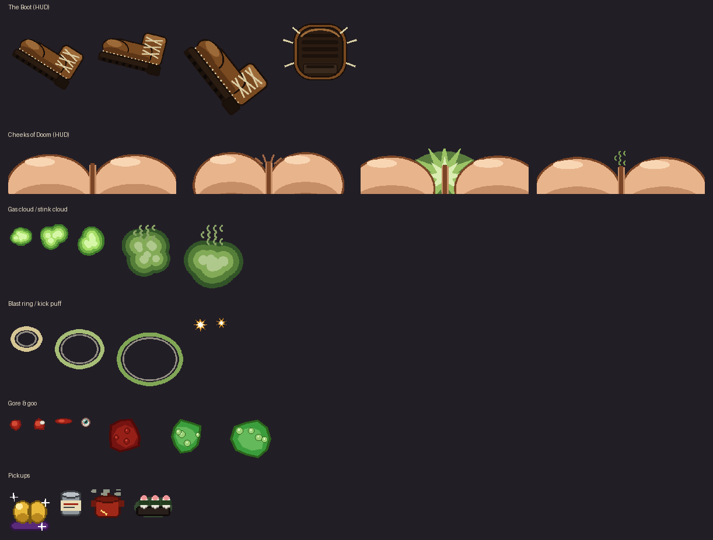

# FIRST-PERSON BOOTER

*It's Doom, but the only guns are your leg and your lunch.*

A gameplay mod for **GZDoom** (the modern id Tech 1 / Doom source port). Every
weapon in the game is replaced by exactly two:

1. **The Boot** — you kick everything in your path. Whatever the kick kills is
   *guaranteed* to detonate into blood, giblets, and regret.
2. **The Cheeks of Doom** — the upgrade. Two bare cheeks occupy the bottom of
   your screen and fire weaponized gas that blows doors open, blows enemies
   away, chokes them until they keel over, or melts them into a bubbling
   green puddle.

It plays on the original Doom/Doom II maps (or the free Freedoom maps) with the
original monsters, movement, and level flow — only the violence delivery
mechanism has changed.



---

## Quick start

### macOS: the paste-one-line way

Open **Terminal** (⌘-space, type "Terminal") and paste:

```sh
/bin/bash -c "$(curl -fsSL https://raw.githubusercontent.com/onlinestuff4me-sketch/first-person-booter/main/run-mac.command)"
```

That runs `run-mac.command`, which finds GZDoom (or offers to
`brew install --cask gzdoom`), downloads the mod and the free Freedoom game
data into `~/Downloads/first-person-booter/`, and launches. It asks before
installing or changing anything.

### The iteration loop (how to develop/update the mod)

The launch line never changes — only the file contents behind it do. So:

1. Change the mod (or have Claude change it — every push includes a freshly
   rebuilt `dist/FirstPersonBooter.pk3`).
2. On your machine, in the repo folder: `git pull`
3. Relaunch GZDoom with the same `-file` parameter as always, e.g. pasted in
   the launcher's *Additional Parameters* box (drag-and-dropping the pk3 onto
   GZDoom.app fills it in for you):

   ```
   -file "/path/to/first-person-booter/dist/FirstPersonBooter.pk3"
   ```

Editing locally instead? Run `python3 tools/build.py` after your edits to
refresh the pk3, then relaunch. GZDoom has no hot-reload — quit and relaunch
to pick up changes (it takes seconds).

macOS niceties to know:

* Modern macOS (Sequoia+) flat-out blocks double-clicked unsigned scripts
  ("Apple could not verify..."), with no Open button. Running things through
  Terminal, as above, sidesteps that entirely. If you *want* the double-click
  route: let it get blocked once, then *System Settings → Privacy & Security*
  → scroll down → **Open Anyway**.
* GZDoom.app itself gets the same treatment if downloaded from zdoom.org —
  the script detects the quarantine flag and offers to clear it (that's the
  `xattr -dr com.apple.quarantine /Applications/GZDoom.app` incantation).
* Don't double-click the `.pk3` — it's not a document, it's cargo. GZDoom
  loads it; the script passes it in for you.

Prefer doing it by hand (or on another OS)? You need three things:
**GZDoom**, an **IWAD** (the base game data), and this mod's **pk3**.

### 1. Install GZDoom (4.10 or newer)

| OS | How |
|---|---|
| Windows | Download from <https://zdoom.org/downloads>, unzip anywhere |
| macOS | `brew install gzdoom` or the dmg from zdoom.org |
| Linux | Flatpak `org.zdoom.GZDoom`, distro package, or the zdoom.org build |

This mod uses ZScript and event handlers, so vanilla DOS Doom, Chocolate
Doom, dsda-doom, etc. will **not** run it. GZDoom is the engine this was
built for.

### 2. Get an IWAD (pick one)

* **Freedoom (free, recommended):** download from
  <https://freedoom.github.io/download.html> and grab `freedoom2.wad` out of
  the zip. Completely free replacement game data — maps, monsters, textures.
* **DOOM2.WAD (if you own Doom II):** find it in your Steam/GOG install
  (`steamapps/common/Doom 2/base/` or similar). Buy it once, mod it forever.

Put the wad next to gzdoom, or in one of GZDoom's standard IWAD search paths.

### 3. Get the mod and run it

Grab `dist/FirstPersonBooter.pk3` from this repo (or build it — see below).

```sh
gzdoom -iwad freedoom2.wad -file FirstPersonBooter.pk3
```

On macOS the app bundle doesn't put `gzdoom` on your PATH; call the binary
inside it (or just use `run-mac.command`):

```sh
/Applications/GZDoom.app/Contents/MacOS/gzdoom \
  -iwad ~/Downloads/freedoom2.wad -file ~/Downloads/FirstPersonBooter.pk3
```

On Windows you can also just drag `FirstPersonBooter.pk3` onto `gzdoom.exe`.
Start a new game. You have a boot. You know what to do.

> Tip for instant gratification: open the console (`~`) and run
> `give CheeksOfDoom` + `give Gas 100`.

---

## The arsenal

| Slot | Weapon | Fire | Alt-fire |
|---|---|---|---|
| 1 | **The Boot** | Kick (140 dmg). Lethal kicks always gib. Survivors get punted by mass — imps fly, barons stumble. | **Wind-up punt.** Slow, ~2.6x damage and launch force. Field-goal range. |
| 2 | **Cheeks of Doom** | Gas cloud projectile. Rips *through* enemy ranks, splats on walls, leaves a growing stink cloud that chokes anything inside (players are immune to their own brand). | **The Thunderclap.** Point-blank blast of hot air: hurls everything nearby away, *melts* whatever stays close (acid), crop-dusts three clouds, and rockets you backwards. |

The four fates, as promised:

* **Explodes / bursts into blood and guts** — any lethal kick (forced extreme
  death + a shower of bouncing meat chunks). Kick a barrel for the classic.
* **Blown away like hot air** — the Thunderclap's radial blast (bosses are too
  fat to move, by design).
* **Poisoned, suffocates, falls over** — die inside a stink cloud: cough-lock,
  keel over, corpse turns green.
* **Melted like acid** — die to the Thunderclap's inner radius: the corpse
  squashes into the floor and becomes a bubbling goo pile. Melted demons
  cannot be resurrected by Arch-viles. Tragic.

Bonus physics: farts **blow doors and lifts open** on impact (locked doors
still check your keys), every fart **alerts the whole map** (obviously), and
alt-firing at the floor is a **fart-jump**. Speedrunners, you're welcome.

### The economy

Ammo is **Gas** (max 100, backpack 200). The world provides:

| Vanilla pickup | Becomes | Gas |
|---|---|---|
| Any weapon | Cheeks of Doom (dupes top you up) | +30 |
| Clip / shells / rockets | Can of beans | +10 |
| Cells / ammo boxes | Five-alarm chili | +25 |
| Cell pack | The Cauldron of Regret | +60 |
| Berserk pack | **Gas-station sushi** (full heal, full tank) | +200 |

Health, armor, keys, and powerups are untouched — it still plays like Doom.

---

## Building from source

```sh
pip install pillow numpy       # only needed to regenerate assets
python3 tools/build.py         # pack pk3/ -> dist/FirstPersonBooter.pk3
python3 tools/build.py --regen # regenerate all sprites+sounds first
python3 tools/check.py         # sanity-check lumps/refs after changes
python3 tools/preview.py       # re-render docs/preview.png
```

Everything in `pk3/sprites`, `pk3/graphics`, and `pk3/sounds` is generated
from scratch by `tools/generate_sprites.py` and `tools/generate_sounds.py` —
cartoon placeholders, deliberately easy to replace.

### Repo map

```
pk3/
  zscript.zs          entry point (#includes below)
  zscript/player.zs   BooterPlayer: starts with Boot + 40 gas
  zscript/boot.zs     Boot weapon, kick logic, impact puff
  zscript/butt.zs     Gas ammo, CheeksOfDoom, GasCloud, StinkCloud, blast FX
  zscript/pickups.zs  world replacements (guns->cheeks, ammo->beans/chili)
  zscript/gore.zs     event handler: gib showers, suffocation, acid melting
  mapinfo.txt         registers player class + event handler
  sndinfo.txt         logical sound names -> wav lumps
  cvarinfo.txt        mod settings (see below)
  trnslate.txt        green corpse palettes
  decaldef.txt        fart wall-splats
tools/                generators, builder, checker, previewer
```

### How it stays "close to Doom"

* No maps are replaced — it runs on any vanilla-compatible map set.
* Monsters aren't modified at all. Kick-gibbing, choking, and melting are
  applied **from the outside** by an event handler (`FPB_GoreHandler`) that
  watches `WorldThingDied` and reacts to the damage type (`Kick`, `FartGas`,
  `FartAcid`). That means it works with Freedoom's cast, Doom's cast, or any
  custom monster pack you load alongside it.
* Kicks force the engine's own *extreme death* (damage is raised past the gib
  threshold on lethal hits), so you get the authentic XDeath animations plus
  our extra meat confetti on top.

### The little details

* Gibbed enemies leave spreading blood pools, chunks smear the walls, and
  ~1 in 6 chunks still has gas in it — it pops with a toot and splash damage
  (yes, it can catch you; stand back from your fireworks).
* Most gibbings launch a lone **eyeball**. It comes to rest. It stares.
  Walk over it to squish it. You'll get a message. You'll deserve it.
* **Demon bowling**: a punted demon knocks down whatever it plows into.
  Two victims is a DOUBLE, three or more is a STRIKE. The announcer cares.
* **Windshield effect**: gib something point-blank and it ends up on your
  lens for a few seconds (`fpb_screengunk 0` to squeegee it off forever).
* Point-blank gibs aside, there's a running **ledger**: an end-of-level stat
  card (boots applied, farts fired, doors blown, demons bowled, suffocated,
  melted, eyeballs squished) prints as the next map loads — or on demand
  with `netevent fpb_stats` in the console.
* Random **tip of the day** on every level start, per-map **gib milestone
  titles** (5 / 15 / 30 / 60 / 100 / 200 kicks), randomized pickup
  one-liners, a baker's dozen quit-screen sendoffs, and — while the cheeks
  are equipped — occasional idle emissions (`fpb_leaky 0` to plug them).

### The Proving Rounds (test arena)

Console (`~`): `map buttest`. A purpose-built playground: monsters and
barrels to kick, one of every pickup on the north shelf, a practice door on
the west side, and a **destructible wall** sealing a loot bunker to the
north — fart it (or kick it) until it gives way. This is the literal
"blows through walls" demo. Exit switch on the east wall.

### The Cheeky Mug (optional addon)

`dist/FPB_CheekyMug.pk3` replaces the status-bar face with a small pair of
cheeks that reacts like the original: looks around idly, bruises as you take
damage, puckers on big hits, smirks at new weapons, clenches on a rampage,
goes gold when invulnerable, deflates when dead. Load it as an extra file:

```
-file ".../FirstPersonBooter.pk3" ".../FPB_CheekyMug.pk3"
```

Don't like being mooned by your own HUD? Remove it from the line. That's
the whole uninstall.

### Settings (console cvars)

| CVar | Default | Meaning |
|---|---|---|
| `fpb_doorfarts` | `true` | gas impacts activate doors/lifts |
| `fpb_fartjump` | `true` | fart recoil + Thunderclap launch |
| `fpb_gore` | `3` | giblet multiplier, `0` (off) – `4` (deli counter) |
| `fpb_leaky` | `true` | idle emissions while cheeks are equipped |
| `fpb_screengunk` | `true` | point-blank gibs splatter the screen briefly |

---

## Upgrading the ass-ets

The placeholders are fine; digitized real objects are funnier. Fun fact: the
original Doom weapons were digitized photographs of real props — so the most
historically authentic upgrade path is to **photograph a real boot**.

### Sprites: what goes where

Sprite lumps live in `pk3/sprites/` as `NNNNF0.png` — 4-char name, frame
letter, `0` = seen from all angles. Replace the PNG, keep the name, rebuild.

| Lump(s) | What it is | Notes |
|---|---|---|
| `BOOTA0–D0` | HUD boot: idle, windup, swing, sole-first impact | biggest visual win |
| `BUTTA0–D0` | HUD cheeks: idle, clench, fire, recover | make it ~480px wide so 16:9 screens get full coverage |
| `FARTA0–C0` | gas projectile puff | |
| `PGASA0–D0` | lingering stink cloud | drawn ~50% transparent in-engine |
| `FBLSA0–C0` | Thunderclap ring | |
| `KPUFA0–B0` | kick impact star | |
| `GIBSA0–E0` | meat chunks (A–D tumble, E is the floor splat) | |
| `GOOPA0–C0` | acid goo puddle | rendered flat on the floor |
| `BUPKA0–B0` | Cheeks pickup (golden butt on a cushion) | |
| `BEANA0`, `CHLIA0`, `MBNSA0–B0` | beans / chili / sushi pickups | |
| `graphics/FSPLAT1–2` | wall splat decals | |

**Offsets matter.** Doom-format sprites carry an (x,y) offset in a PNG `grAb`
chunk; it controls where the image sits on screen.

* World sprites (pickups, gibs): `x = width/2`, `y = height` (feet on floor).
* Projectiles/FX: `x = width/2`, `y ≈ height/2`.
* HUD weapons: on the 320x200 weapon canvas, `screen_left ≈ 1 - x_offset`,
  `screen_top = 32 - y_offset` at rest. The cheeks use offset `(79, -120)`
  → top edge at y≈152, i.e. the lower quarter of the screen.

Two easy ways to set offsets: edit the constants at the top of
`tools/generate_sprites.py` (it writes `grAb` for you), or open the pk3 in
**SLADE** (<https://slade.mancubus.net>) and use *Gfx → Set Offsets →
Auto → Weapon/Monster*.

### Making the art

* **Digitize a prop (the id Software way):** photograph a real boot against a
  plain background in 4 poses (relaxed, pulled back, mid-swing, sole at
  camera). Cut the background (`pip install rembg`, or GIMP's fuzzy select),
  scale to roughly the placeholder sizes, darken/posterize so it sits in
  Doom's moody palette (GIMP: *Colors → Posterize* ~24 levels, pull
  brightness down), save as PNG, set offsets. Same recipe works for the
  cheeks; keep it PG-13 cartoon.
* **AI-generate:** any image generator will do. Prompts that land in the
  right style: *"1990s FPS weapon sprite, first-person view of a worn brown
  leather work boot mid-kick, sole facing camera, dark gritty palette, chunky
  pixel art, black background"* — generate, remove background, downscale to
  ~300px, posterize. Generate each animation frame as a variation.
* **Pixel-edit:** Aseprite / Libresprite / GIMP. The generator's output is a
  decent base layer to paint over.

### Making the sounds

Lumps live in `pk3/sounds/` as 22 kHz mono WAVs; names are mapped in
`pk3/sndinfo.txt` (e.g. `butt/fart1 -> FART1.wav`). Replace the file, keep
the name. Sources, in ascending order of dignity:

* **Synthesized:** tweak `tools/generate_sounds.py` — every sound is a
  seeded function; change `f0`, duration, `sputter`, re-run.
* **Freesound:** <https://freesound.org>, search *"fart"*, *"whoopee
  cushion"*, *"splat wet"*, *"squish"*; filter License → Creative Commons 0.
  Convert with Audacity (*Tracks → Resample 22050*, mix to mono, export WAV).
* **Foley (correct answer):** a real whoopee cushion for the brass section; a
  wet sponge slammed into a cutting board for gibs; celery snapped near the
  mic for bone. Pitch everything down 15–25% for menace.
* **Retro bleeps:** jsfxr (<https://sfxr.me>) for the pickup jingle.

After any swap: `python3 tools/check.py && python3 tools/build.py`.

---

## Troubleshooting

* **"Script error" on startup** — GZDoom prints the file and line. The two
  most engine-version-sensitive calls are `level.ExecuteSpecial(...)` in
  `zscript/butt.zs` (`TryBlowDoor` — delete the function body and door-farts
  degrade gracefully) and `A_Blast(...)` in `A_MegaFart` (comment it out and
  the Thunderclap loses its shove but keeps the acid).
* **Weapon art floats in the wrong place** — your art's canvas differs from
  the placeholder's; fix the `SCREEN_*` constants in
  `tools/generate_sprites.py` or set offsets in SLADE (see above).
* **Cheeks don't reach the screen edges in widescreen** — widen the
  `BUTT*0` canvases (the default is 480px for ~16:9).
* **No fart on door** — check `fpb_doorfarts` isn't `0`; only door/lift-type
  specials respond (exits deliberately don't, you maniac).

## Legal

This repo contains **no id Software assets**. All code, art, and audio here
are original and generated by the scripts in `tools/`; consider them CC0 —
remix loudly. You supply the game data yourself: Freedoom (BSD-licensed) or
a legally purchased DOOM2.WAD. GZDoom is GPLv3, by the ZDoom team, standing
on 30 years of id Tech 1.

*"Rip and tear" is a lifestyle. "Point and toot" is a philosophy.*
